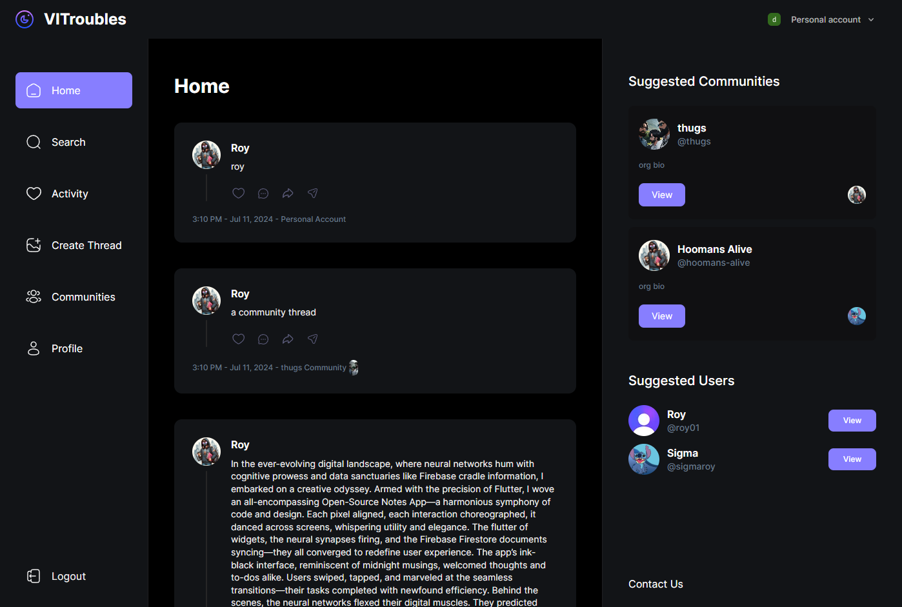

<h1 align='center'>
VITroubles
</h1>
<p align='center' style="font-size:1.5em; font-weight:bold;">
"Navigate, synergize, and conquer academic hurdles on VITroubles” 🗣️
</p>

VITroubles is a vibrant forum to synergize with peers, share insights, and tackle university challenges. Elevate your academic journey through collaboration and support. Your path to success begins here!
##### View Deployment: https://vitroubles.vercel.app/


## Built With
<p align='center'> 


</p>

## Home Page ScreenShot
<p align='center'>

</p>

## For using on local machine

#### Clone the Repository
```bash
git clone [project-name]
```

#### Install the Project Using
```bash
npm install
# or
yarn install
```

#### Create a .env file in the root directory and add the following
```bash
NEXT_PUBLIC_CLERK_PUBLISHABLE_KEY= [your clerk publishable key]
CLERK_SECRET_KEY= [your clerk secret key]
NEXT_CLERK_WEBHOOK_SECRET= [your clerk webhook secret]

NEXT_PUBLIC_CLERK_SIGN_IN_URL=/sign-in 
NEXT_PUBLIC_CLERK_SIGN_UP_URL=/sign-up 
NEXT_PUBLIC_CLERK_FALLBACK_REDIRECT_URL=/onboarding 

MONGODB_URL= [your mongodb atlas url with ID and password]

UPLOADTHING_SECRET= [your uploadthing secret]
UPLOADTHING_APP_ID= [your uploadthing app id]

NEXT_PUBLIC_EMAILJS_PUBLIC_KEY= [your emailjs public key]
NEXT_PUBLIC_EMAILJS_TEMPLATE_ID= [your emailjs template id]
NEXT_PUBLIC_EMAILJS_SERVICE_ID= [your emailjs service id]
```

#### Run the Project Using
```bash
npm run dev
#or
yarn dev
```

#### View the local deployment at
```bash
http://localhost:3000
```

## Contributing

Please feel free to contribute to this repository. Contributions are always welcomed. 
Create a pull request incase you feel some more better changes could be made to the site and we will review your changes.
